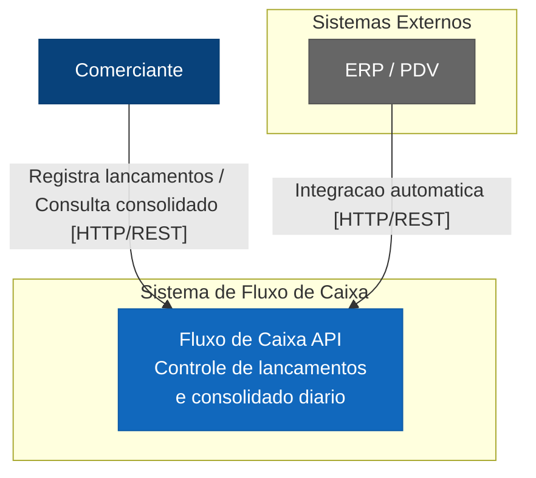
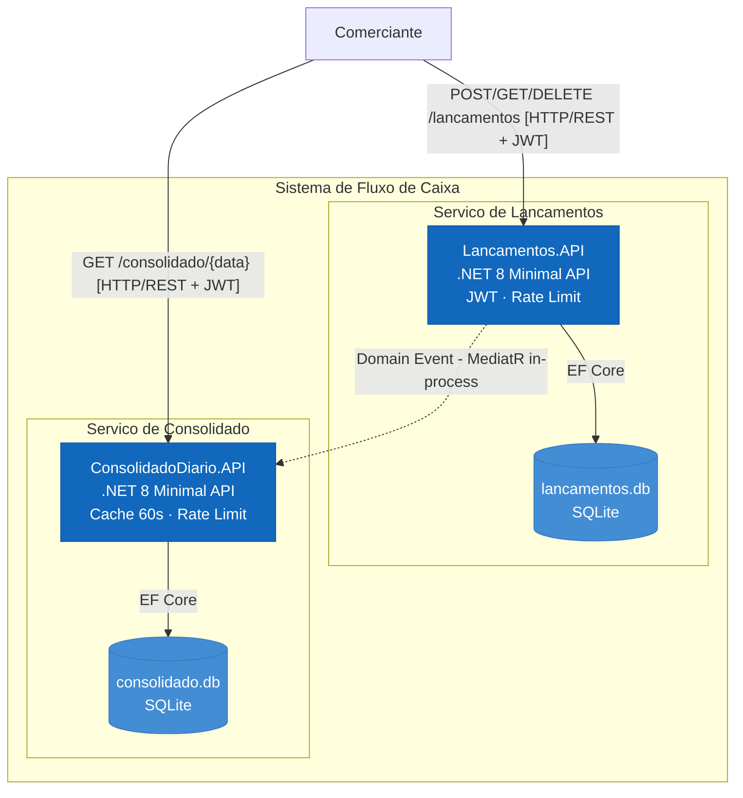
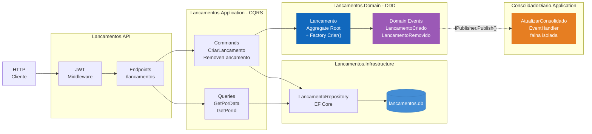
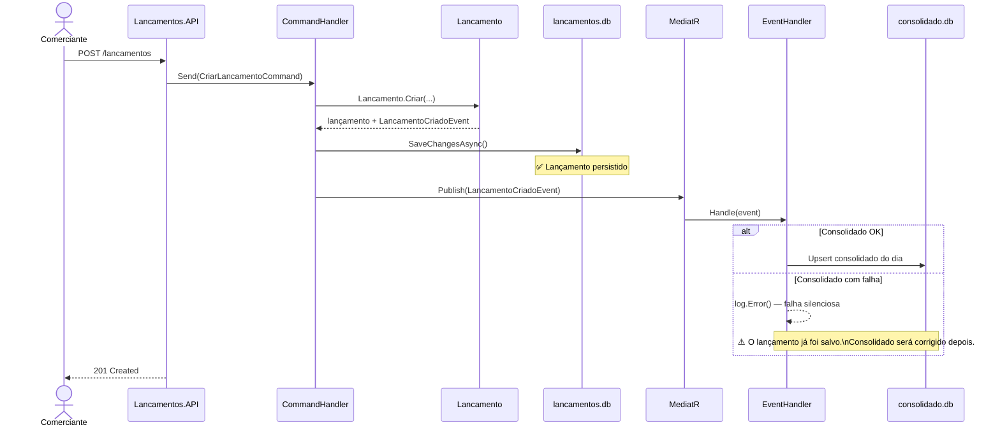
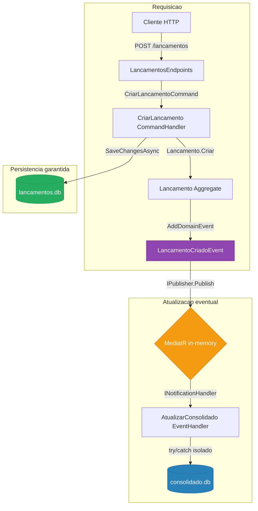
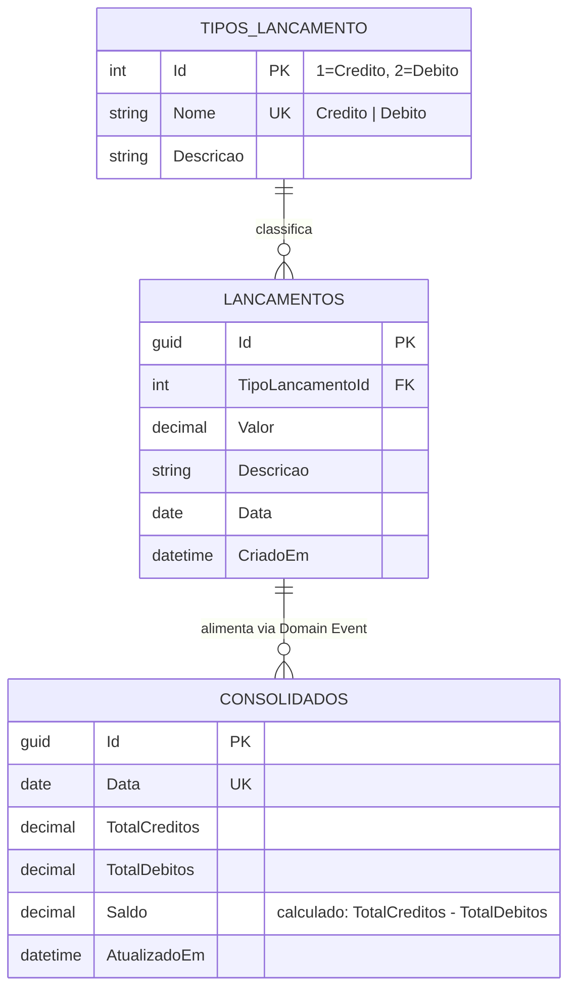
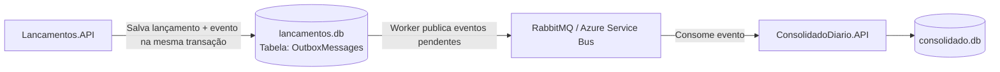

# Fluxo de Caixa

Sistema de controle de fluxo de caixa diário para comerciantes, composto por dois serviços independentes: **Lançamentos** e **Consolidado Diário**.

> Desafio técnico para a posição de Arquiteto de Software.

---

## Sumário

- [Visão Geral](#visão-geral)
- [Requisitos de Negócio](#requisitos-de-negócio)
- [Arquitetura](#arquitetura)
  - [Visão de Contexto (C4 Nível 1)](#visão-de-contexto-c4-nível-1)
  - [Visão de Containers (C4 Nível 2)](#visão-de-containers-c4-nível-2)
  - [Visão de Componentes — Lançamentos (C4 Nível 3)](#visão-de-componentes--lançamentos-c4-nível-3)
  - [Fluxo de Criação de Lançamento](#fluxo-de-criação-de-lançamento)
  - [Desacoplamento via Domain Events](#desacoplamento-via-domain-events)
  - [Modelo de Dados](#modelo-de-dados)
- [Estrutura da Solução](#estrutura-da-solução)
- [Tecnologias](#tecnologias)
- [Padrões de Design e SOLID](#padrões-de-design-e-solid)
- [ADRs — Architectural Decision Records](#adrs--architectural-decision-records)
- [Como Rodar Localmente](#como-rodar-localmente)
- [Endpoints da API](#endpoints-da-api)
- [Testes](#testes)
- [Evolução Futura](#evolução-futura)

---

## Visão Geral

Um comerciante precisa controlar seu fluxo de caixa diário com lançamentos de débitos e créditos, e ter acesso a um relatório com o saldo diário consolidado.

**Requisito crítico de resiliência:** o serviço de lançamentos **não pode ficar indisponível** se o serviço de consolidado diário cair. O consolidado recebe até 50 req/s em picos, com no máximo 5% de perda de requisições.

---

## Requisitos de Negócio

| # | Requisito | Tipo |
|---|-----------|------|
| RN01 | Registrar lançamentos de débito e crédito | Funcional |
| RN02 | Consultar lançamentos por data | Funcional |
| RN03 | Remover um lançamento | Funcional |
| RN04 | Consultar saldo consolidado de uma data | Funcional |
| RN05 | Serviço de lançamentos disponível mesmo se consolidado cair | Não-Funcional |
| RN06 | Consolidado suporta 50 req/s com máx 5% de perda | Não-Funcional |

---

## Arquitetura

A solução adota **Clean Architecture** com **DDD (Domain-Driven Design)**, separando os dois bounded contexts em projetos independentes que se comunicam via **Domain Events** (padrão assíncrono in-process com MediatR, substituível por RabbitMQ/Azure Service Bus em produção).

### Visão de Contexto (C4 Nível 1)



### Visão de Containers (C4 Nível 2)



### Visão de Componentes — Lançamentos (C4 Nível 3)



### Fluxo de Criação de Lançamento



### Desacoplamento via Domain Events



### Modelo de Dados



---

## Estrutura da Solução

```
fluxocaixa/
├── fluxocaixa.sln
├── README.md
├── docs/
│   └── adr/                         # Architectural Decision Records
│       ├── README.md
│       ├── ADR-001-clean-architecture.md
│       ├── ADR-002-ddd-bounded-contexts.md
│       ├── ADR-003-cqrs-mediatr.md
│       ├── ADR-004-domain-events-desacoplamento.md
│       ├── ADR-005-sqlite-efcore.md
│       ├── ADR-006-minimal-api-openapi.md
│       └── ADR-007-testes-xunit-nsubstitute.md
│
├── src/
│   ├── SharedKernel/                # Contratos e bases DDD compartilhados
│   │   ├── Entity.cs
│   │   ├── ValueObject.cs
│   │   ├── AggregateRoot.cs
│   │   ├── IDomainEvent.cs
│   │   └── IUnitOfWork.cs
│   │
│   ├── Lancamentos/
│   │   ├── Lancamentos.Domain/
│   │   │   ├── Entities/Lancamento.cs          # Aggregate Root + Factory
│   │   │   ├── ValueObjects/Dinheiro.cs         # Value Object imutável
│   │   │   ├── ValueObjects/TipoLancamento.cs   # Enum de domínio
│   │   │   ├── Events/LancamentoCriadoEvent.cs
│   │   │   ├── Events/LancamentoRemovidoEvent.cs
│   │   │   └── Repositories/ILancamentoRepository.cs
│   │   │
│   │   ├── Lancamentos.Application/
│   │   │   ├── Commands/CriarLancamento/
│   │   │   ├── Commands/RemoverLancamento/
│   │   │   ├── Queries/GetLancamentoPorData/
│   │   │   ├── Queries/GetLancamentoPorId/
│   │   │   └── DTOs/LancamentoDto.cs
│   │   │
│   │   ├── Lancamentos.Infrastructure/
│   │   │   ├── Persistence/LancamentosDbContext.cs
│   │   │   ├── Persistence/Configurations/
│   │   │   ├── Repositories/LancamentoRepository.cs
│   │   │   └── UnitOfWork.cs
│   │   │
│   │   └── Lancamentos.API/
│   │       ├── Program.cs
│   │       └── Endpoints/LancamentosEndpoints.cs
│   │
│   └── ConsolidadoDiario/
│       ├── ConsolidadoDiario.Domain/
│       │   ├── Entities/ConsolidadoDiario.cs    # Aggregate Root
│       │   └── Repositories/IConsolidadoDiarioRepository.cs
│       │
│       ├── ConsolidadoDiario.Application/
│       │   ├── EventHandlers/AtualizarConsolidadoEventHandler.cs
│       │   ├── EventHandlers/RecalcularConsolidadoEventHandler.cs
│       │   ├── Queries/GetConsolidadoPorData/
│       │   └── DTOs/ConsolidadoDto.cs
│       │
│       ├── ConsolidadoDiario.Infrastructure/
│       │   ├── Persistence/ConsolidadoDbContext.cs
│       │   ├── Persistence/Configurations/
│       │   ├── Repositories/ConsolidadoDiarioRepository.cs
│       │   └── ConsolidadoUnitOfWork.cs
│       │
│       └── ConsolidadoDiario.API/
│           ├── Program.cs
│           └── Endpoints/ConsolidadoEndpoints.cs
│
└── tests/
    ├── Lancamentos.UnitTests/
    │   ├── Domain/LancamentoTests.cs
    │   └── Application/CriarLancamentoCommandHandlerTests.cs
    └── ConsolidadoDiario.UnitTests/
        └── Application/AtualizarConsolidadoEventHandlerTests.cs
```

---

## Tecnologias

| Tecnologia | Versão | Papel |
|---|---|---|
| .NET / C# | 8.0 | Runtime e linguagem |
| ASP.NET Core Minimal API | 8.0 | Camada HTTP |
| MediatR | 12.4 | CQRS + Domain Events in-process |
| Entity Framework Core | 8.0 | ORM |
| SQLite | — | Banco de dados (um por serviço) |
| Swashbuckle / OpenAPI | 6.6 | Documentação da API |
| xUnit | 2.9 | Framework de testes |
| FluentAssertions | 6.12 | Asserções expressivas |
| NSubstitute | 5.3 | Mocking nos testes unitários |

---

## Padrões de Design e SOLID

### Padrões Aplicados

| Padrão | Onde | Benefício |
|---|---|---|
| **Aggregate Root** | `Lancamento`, `ConsolidadoDiario` | Protege invariantes de domínio; único ponto de mutação |
| **Factory Method** | `Lancamento.Criar(...)` | Encapsula regras de criação; impede estado inválido |
| **Value Object** | `Dinheiro`, `TipoLancamento` | Imutabilidade; igualdade por valor, não por referência |
| **Domain Event** | `LancamentoCriadoEvent`, `LancamentoRemovidoEvent` | Desacopla Lançamentos de ConsolidadoDiario |
| **CQRS** | Commands + Queries separados via MediatR | Separação de intenção; escalabilidade de leitura |
| **Repository** | `ILancamentoRepository`, `IConsolidadoDiarioRepository` | Abstrai persistência; testabilidade |
| **Unit of Work** | `IUnitOfWork` → `UnitOfWork` / `ConsolidadoUnitOfWork` | Garante atomicidade da transação |
| **Mediator** | `IMediator` / `IPublisher` do MediatR | Desacopla handlers; evita dependências diretas |

### Princípios SOLID

| Princípio | Aplicação concreta |
|---|---|
| **SRP** — Single Responsibility | Cada handler tem uma única responsabilidade (`CriarLancamentoCommandHandler` só cria; `GetLancamentoPorDataQueryHandler` só consulta) |
| **OCP** — Open/Closed | Novos tipos de lançamento ou novas queries não exigem modificar código existente — basta adicionar novos handlers |
| **LSP** — Liskov Substitution | `LancamentoRepository` é substituível por qualquer implementação de `ILancamentoRepository` (ex: in-memory para testes) |
| **ISP** — Interface Segregation | `ILancamentoRepository` e `IConsolidadoDiarioRepository` são contratos mínimos e específicos de cada domínio |
| **DIP** — Dependency Inversion | A camada Application depende de `ILancamentoRepository` (interface do Domain), nunca de `LancamentosDbContext` (detalhe de infra) |

---

## ADRs — Architectural Decision Records

As decisões arquiteturais estão documentadas em `docs/adr/`:

| ADR | Título | Status |
|---|---|---|
| [ADR-001](docs/adr/ADR-001-clean-architecture.md) | Adoção de Clean Architecture | Aceito |
| [ADR-002](docs/adr/ADR-002-ddd-bounded-contexts.md) | DDD com Bounded Contexts separados | Aceito |
| [ADR-003](docs/adr/ADR-003-cqrs-mediatr.md) | CQRS com MediatR | Aceito |
| [ADR-004](docs/adr/ADR-004-domain-events-desacoplamento.md) | Domain Events para desacoplamento entre serviços | Aceito |
| [ADR-005](docs/adr/ADR-005-sqlite-efcore.md) | SQLite com EF Core (um banco por serviço) | Aceito |
| [ADR-006](docs/adr/ADR-006-minimal-api-openapi.md) | ASP.NET Core Minimal API com OpenAPI/Swagger | Aceito |
| [ADR-007](docs/adr/ADR-007-testes-xunit-nsubstitute.md) | xUnit + FluentAssertions + NSubstitute para testes | Aceito |
| [ADR-008](docs/adr/ADR-008-tipo-lancamento-tabela-dominio.md) | TipoLancamento como tabela de domínio no banco de dados | Aceito |
| [ADR-009](docs/adr/ADR-009-seguranca-jwt.md) | Autenticação com JWT Bearer | Aceito |
| [ADR-010](docs/adr/ADR-010-rate-limiting-cache-health.md) | Rate Limiting, Cache e Health Checks para 50 req/s | Aceito |

---

## Como Rodar Localmente

### Pré-requisitos

- [.NET 8 SDK](https://dotnet.microsoft.com/download/dotnet/8.0)

### Verificar instalação

```bash
dotnet --version
# deve retornar 8.x.x
```

### Restaurar dependências

```bash
dotnet restore fluxocaixa.sln
```

### Rodar o serviço de Lançamentos (porta 5092)

O serviço de Lançamentos também registra os event handlers do Consolidado — ambos os bancos são criados automaticamente na primeira execução.

```bash
dotnet run --project src/Lancamentos/Lancamentos.API
```

Acesse a documentação interativa em: **http://localhost:5092/swagger**

### Rodar o serviço de Consolidado Diário (porta 5093)

```bash
dotnet run --project src/ConsolidadoDiario/ConsolidadoDiario.API
```

Acesse a documentação interativa em: **http://localhost:5093/swagger**

### Rodar ambos simultaneamente (terminais separados)

```bash
# Terminal 1
dotnet run --project src/Lancamentos/Lancamentos.API

# Terminal 2
dotnet run --project src/ConsolidadoDiario/ConsolidadoDiario.API
```

> **Atenção:** cada serviço possui seu próprio Swagger independente. O Swagger da Lançamentos API (`/swagger` na porta 5092) contém os endpoints de autenticação e lançamentos. O Swagger da Consolidado API (`/swagger` na porta 5093) contém apenas o endpoint de consolidado diário.

> **Nota sobre `--urls`:** ao passar `--urls` explicitamente na linha de comando, o `launchSettings.json` é ignorado e o ambiente volta a ser `Production`, o que desativa o Swagger. Se precisar sobrescrever a porta, adicione `--environment Development`:
> ```bash
> dotnet run --project src/Lancamentos/Lancamentos.API --urls "http://localhost:5092" --environment Development
> ```

### Autenticação — obter token JWT

Todos os endpoints de negócio requerem autenticação. Obtenha um token antes de usar a API:

```bash
curl -X POST http://localhost:5092/auth/token \
  -H "Content-Type: application/json" \
  -d '{ "usuario": "comerciante", "senha": "senha123" }'
```

Resposta:
```json
{ "token": "eyJhbGci...", "expiraEm": "60 minutos" }
```

Use o token nas demais chamadas:
```bash
curl http://localhost:5092/lancamentos?data=2025-06-01 \
  -H "Authorization: Bearer eyJhbGci..."
```

No **Swagger UI**: clique em **Authorize** (cadeado), cole o token e confirme.

> **Usuários disponíveis para demo:**
> - `comerciante` / `senha123`
> - `admin` / `admin123`

> **Produção:** substitua o secret em `appsettings.json` por variável de ambiente:
> ```bash
> export Jwt__Secret="sua-chave-segura-com-mais-de-32-caracteres"
> ```

### Health Checks

Verifique a disponibilidade dos serviços (sem autenticação):

```bash
curl http://localhost:5092/health
curl http://localhost:5093/health
```

---

## Endpoints da API

### Lançamentos API — `http://localhost:5092`

| Método | Rota | Auth | Descrição |
|---|---|---|---|
| `POST` | `/auth/token` | Público | Gera token JWT |
| `GET` | `/health` | Público | Health check |
| `POST` | `/lancamentos` | Bearer | Registra um débito ou crédito |
| `GET` | `/lancamentos?data=yyyy-MM-dd` | Bearer | Lista lançamentos de uma data |
| `GET` | `/lancamentos/{id}` | Bearer | Busca um lançamento pelo ID |
| `DELETE` | `/lancamentos/{id}` | Bearer | Remove um lançamento |

**Exemplo — registrar lançamento:**

```bash
# 1. Obter token
TOKEN=$(curl -s -X POST http://localhost:5092/auth/token \
  -H "Content-Type: application/json" \
  -d '{"usuario":"comerciante","senha":"senha123"}' | grep -o '"token":"[^"]*"' | cut -d'"' -f4)

# 2. Usar o token
curl -X POST http://localhost:5092/lancamentos \
  -H "Content-Type: application/json" \
  -H "Authorization: Bearer $TOKEN" \
  -d '{
    "tipo": 1,
    "valor": 1500.00,
    "descricao": "Venda balcão - cliente João",
    "data": "2025-06-01"
  }'
```

> `tipo`: `1` = Crédito, `2` = Débito

**Exemplo — listar por data:**

```bash
curl http://localhost:5092/lancamentos?data=2025-06-01 \
  -H "Authorization: Bearer $TOKEN"
```

### Consolidado Diário API — `http://localhost:5093`

| Método | Rota | Auth | Descrição |
|---|---|---|---|
| `GET` | `/health` | Público | Health check |
| `GET` | `/consolidado/{data}` | Bearer | Retorna saldo consolidado da data (cache 60s) |

**Exemplo:**

```bash
curl http://localhost:5093/consolidado/2025-06-01 \
  -H "Authorization: Bearer $TOKEN"
```

**Resposta:**

```json
{
  "id": "3fa85f64-...",
  "data": "2025-06-01",
  "totalCreditos": 2500.00,
  "totalDebitos": 800.00,
  "saldo": 1700.00,
  "atualizadoEm": "2025-06-01T14:32:10Z"
}
```

---

## Testes

```bash
# Rodar todos os testes
dotnet test fluxocaixa.sln

# Com relatório de cobertura (requer coverlet)
dotnet test fluxocaixa.sln --collect:"XPlat Code Coverage"
```

### Cobertura de testes

| Suite | Testes | O que cobre |
|---|---|---|
| `Lancamentos.UnitTests/Domain` | 11 testes | `Lancamento`, `Dinheiro`: criação, validação, eventos, arredondamento |
| `Lancamentos.UnitTests/Application` | 11 testes | `CriarLancamento` e `RemoverLancamento`: handlers, ordem commit→publish, falhas |
| `ConsolidadoDiario.UnitTests` | 10 testes | Event handlers: criação, acúmulo, estorno, datas distintas, saldo negativo, erro silencioso |

---

## Evolução Futura

### Broker de mensagens externo (produção)

Para garantia de entrega em produção, substituir o `IPublisher` do MediatR por um `IMessageBus` com implementação RabbitMQ ou Azure Service Bus + **Outbox Pattern**:



### Escalabilidade do Consolidado Diário

Para suportar cargas maiores que 50 req/s, adicionar:

1. **Cache em memória** (`IMemoryCache`) para o endpoint GET por data — TTL de 1 min
2. **Rate limiting** no ASP.NET Core 8 (`AddRateLimiter`)
3. **Leitura de réplica** do banco (read replica) para queries do consolidado
4. **Balanceamento de carga** com múltiplas instâncias do ConsolidadoDiario.API

### Segurança

- Autenticação JWT com `Microsoft.AspNetCore.Authentication.JwtBearer`
- Autorização por papel (comerciante vs admin)
- HTTPS obrigatório em produção
- Proteção contra ataques de enumeração de IDs (GUIDs mitigam)

### Observabilidade

- Structured logging com Serilog
- Health checks (`/health`) para cada serviço
- Métricas com OpenTelemetry
- Distributed tracing (correlationId nos Domain Events)
