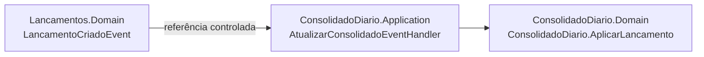

# ADR-002 — Modelar domínio com DDD e Bounded Contexts separados

- **Status:** Aceito
- **Data:** 2025-06
- **Contexto relacionado:** ADR-001 (Clean Architecture), ADR-004 (Domain Events)

---

## Contexto

O sistema possui dois domínios com responsabilidades distintas:

1. **Lançamentos** — registrar e consultar transações financeiras (débito/crédito)
2. **Consolidado Diário** — agregar e disponibilizar o saldo por data

Esses domínios têm modelos conceituais diferentes: um "lançamento" no contexto de Lançamentos é uma transação individual com tipo, valor e data. No contexto do Consolidado, um "lançamento" é apenas um evento que altera contadores agregados — o conceito se transforma ao atravessar a fronteira.

O requisito de que o serviço de lançamentos **não pode ficar indisponível se o consolidado cair** indica que esses dois domínios devem ter independência de deploy e de dados.

---

## Decisão

Aplicar **Domain-Driven Design (DDD)** com dois **Bounded Contexts** separados, cada um com:

- Seu próprio Aggregate Root com invariantes
- Seu próprio banco de dados (SQLite independente)
- Seu próprio namespace e conjunto de projetos

### Bounded Context: Lançamentos

```
Aggregate Root: Lancamento
  ├── Id (Guid)
  ├── Tipo: TipoLancamento (Value Object/enum)
  ├── Valor: Dinheiro (Value Object)
  ├── Descricao: string
  ├── Data: DateOnly
  └── CriadoEm: DateTime

Domain Events:
  ├── LancamentoCriadoEvent
  └── LancamentoRemovidoEvent

Factory: Lancamento.Criar(tipo, valor, descricao, data)
  └── Valida e emite LancamentoCriadoEvent
```

**Invariantes protegidas pelo Aggregate:**
- Valor deve ser maior que zero (`Dinheiro.Criar` valida)
- Descrição é obrigatória e não vazia
- Data é obrigatória
- Tipo deve ser `Credito` ou `Debito`

### Bounded Context: Consolidado Diário

```
Aggregate Root: ConsolidadoDiario
  ├── Id (Guid)
  ├── Data: DateOnly (única por dia)
  ├── TotalCreditos: decimal
  ├── TotalDebitos: decimal
  ├── Saldo: decimal (calculado)
  └── AtualizadoEm: DateTime

Métodos de domínio:
  ├── AplicarLancamento(tipo, valor)
  └── EstornarLancamento(tipo, valor)
```

**Invariantes:**
- Saldo é sempre `TotalCreditos - TotalDebitos` (calculado no Aggregate, nunca armazenado diretamente)
- Apenas um consolidado por data (constraint único no banco)
- Estorno nunca deixa total negativo (`Math.Max(0, ...)`)

### Value Objects

| Value Object | Bounded Context | Regras |
|---|---|---|
| `Dinheiro` | Lancamentos | `valor > 0`, arredondado para 2 casas |
| `TipoLancamento` | Lancamentos | enum: `Credito = 1`, `Debito = 2` |

### Anti-Corruption Layer (ACL)

A comunicação entre os bounded contexts ocorre via Domain Events — o `ConsolidadoDiario.Application` consome `LancamentoCriadoEvent` do namespace `Lancamentos.Domain.Events`. Isso é uma referência de projeto controlada, não um acoplamento direto entre aggregates.



---

## Alternativas Consideradas

### Modelo único com uma entidade `Lancamento` e agregação por query

Um único banco e uma entidade `Lancamento`, com o consolidado calculado na hora via `SUM()` no banco.

Rejeitado porque:
- Viola o requisito de independência entre os serviços
- O consolidado ficaria acoplado à disponibilidade do banco de lançamentos
- Escalar o consolidado independentemente seria inviável

### Dois serviços completamente independentes sem referência de projeto

Cada serviço seria um processo separado sem nenhum projeto compartilhado, comunicando via HTTP ou mensageria.

Rejeitado para este desafio porque:
- Exigiria serialização/deserialização de contratos entre serviços
- Duplicaria a definição de `TipoLancamento` e `LancamentoCriadoEvent`
- A referência de projeto ao `Lancamentos.Domain` é uma ACL legítima — o ConsolidadoDiario consome apenas os eventos, não o aggregate

---

## Consequências

**Positivas:**
- Cada domínio pode evoluir independentemente (novos campos em `Lancamento` não impactam `ConsolidadoDiario`)
- Os aggregates protegem invariantes de negócio — impossível criar um lançamento inválido via código
- O Factory Method `Lancamento.Criar(...)` é o único ponto de criação — facilita auditoria

**Negativas:**
- Duplicação conceitual de `TipoLancamento` nos dois contextos (mitigada pela referência ao `Lancamentos.Domain`)
- Maior overhead de compreensão para desenvolvedores não familiarizados com DDD
- Consistência eventual entre os bancos (o consolidado pode ficar desatualizado brevemente)

---

## Referências

- Eric Evans — *Domain-Driven Design: Tackling Complexity in the Heart of Software* (2003)
- Vaughn Vernon — *Implementing Domain-Driven Design* (2013)
- [Bounded Context (Martin Fowler)](https://martinfowler.com/bliki/BoundedContext.html)
- [Value Object (Martin Fowler)](https://martinfowler.com/bliki/ValueObject.html)
